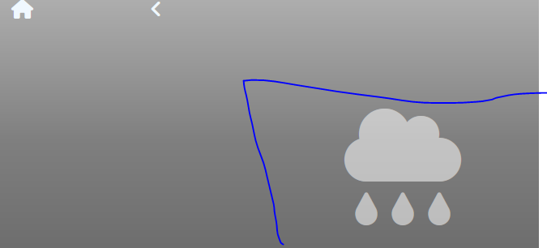
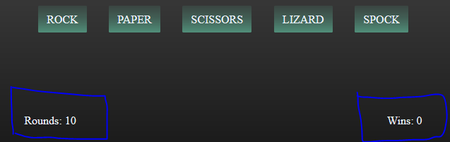

# RPSLS game
These two screenshots are from LT Browser

### Description
The website introduces the mini game of RPSLS.
 
The website is devided into 3 sections/pages.
 
First page to announce and inform the players of the rewards of the mini game.
 
Second page is to visually show that there are four levels to this game.
And that they can only play one level and need to unlock other levels.
 
Third page is the plane of the gameplay.
  
The game increases in difficulty with each level by redusing the chance of players to win the rounds.

## Main first page
tabular information of what to expect of the website & a call to action button.

## Level second page
Display all levels of the game with some transparency & home button.
If the level is playable, the level will be interactable & with full color.

## Game plane third page
Game plane & back and home buttons.
- Navigation icons for buttons to navigate through the website.
- An icon to indicate the level of the game.
- A next button to reset and change the level to the next one after winning at least 3 wounds.
- Initially empty section. To show the player result of the round.
- A section to show the hands picked by player and bot.
- Player's deck of hands.
- Section for showing the remaining rounds to play & the number of wins.
- End screen

Navigation icons for buttons to navigate through the website.

    

An icon to indicate the level of the game.

    

A next button to reset and change the level to the next one after winning at least 3 wounds.

    

Initially empty section. To show the player result of the round.

    
    

A section to show the hands picked by player and bot.

    

Player's deck of hands.

    

Section for showing the remaining rounds to play & the number of wins.

    

End screen to congrat the playeron finishing the game. And stop all interactivity of the game page.

    

## Test
The testing was done throughout the development phase, on completion of each feature before each commit.
I fixed everything that came up and i could think of at that time.
I have tested the finished game and it seems to work as intended with no problems.

### Validator
- HTML
    1. Home no error <a href="https://validator.w3.org/nu/?doc=https%3A%2F%2Fadept-fray.github.io%2Frpsls-game%2Findex.html">W3C validator</a>.
    2. Level no error <a href="https://validator.w3.org/nu/?doc=https%3A%2F%2Fadept-fray.github.io%2Frpsls-game%2Flevel.html">W3C validator</a>.
    3. Game no error <a href="https://validator.w3.org/nu/?doc=https%3A%2F%2Fadept-fray.github.io%2Frpsls-game%2Fgame.html">W3C validator</a>.
- CSS
    1. Home no error <a href="https://jigsaw.w3.org/css-validator/validator?uri=https%3A%2F%2Fadept-fray.github.io%2Frpsls-game%2Findex.html&profile=css3svg&usermedium=all&warning=1&vextwarning=&lang=en">(Jigsaw) validator</a>.
    2. Level no error <a href="https://jigsaw.w3.org/css-validator/validator?uri=https%3A%2F%2Fadept-fray.github.io%2Frpsls-game%2Flevel.html&profile=css3svg&usermedium=all&warning=1&vextwarning=&lang=en">(Jigsaw) validator</a>.
    3. Game no error <a href="https://jigsaw.w3.org/css-validator/validator?uri=https%3A%2F%2Fadept-fray.github.io%2Frpsls-game%2Fgame.html&profile=css3svg&usermedium=all&warning=1&vextwarning=&lang=en">(Jigsaw) validator</a>.
- JS
    1. Not used it yet.

## Unattended
Reset the game details after the end screen so after page refresh players start at zero again.

## Credit
- Icons are taken from <a href="https://fontawesome.com/">font awesome.</a>
- Home picture is from <a href="https://www.pexels.com/sv-se/foto/tra-vag-man-manniskor-163036/">pexels.</a>
- Level picture is from <a href="https://pixabay.com/photos/dice-game-monochrome-roll-the-dice-1502706/">pixabay.</a>

## Deployment
The website was deployed on github-pages.
- steps
 + In the GitHub repository, navigate to the Settings tab
 + From the source section drop-down menu, select the Master Branch
 + Once the master branch has been selected, the page will be automatically refreshed with a detailed ribbon display to indicate the successful deployment.

The live link can be found here - https://adept-fray.github.io/rpsls-game/index.html