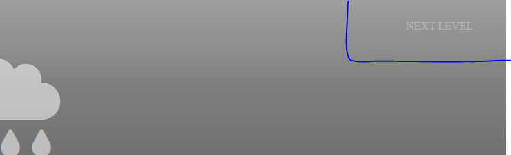

# RPSLS game
These two screenshots are from LT Browser

## Main first page
tabular information of what to expect of the website & a call to action button.

## Level second page
Display all levels of the game with some transparency & home button.
If the level is playable, the level will be interactable & with full color.

## Game plane third page
Game plane & back and home buttons.
- Navigation icons for buttons to navigate through the website.
- An icon to indicate the level of the game.
- A next button to reset and change the level to the next one after winning at least 3 wounds.
- Initially empty section. To show the player result of the round.
- A section to show the hands picked by player and bot.
- Player's deck of hands.
- Section for showing the remaining rounds to play & the number of wins.

Navigation icons for buttons to navigate through the website.

    

An icon to indicate the level of the game.

    

A next button to reset and change the level to the next one after winning at least 3 wounds.

    

Initially empty section. To show the player result of the round.

    
    

A section to show the hands picked by player and bot.

    

Player's deck of hands.

    

Section for showing the remaining rounds to play & the number of wins.

    

